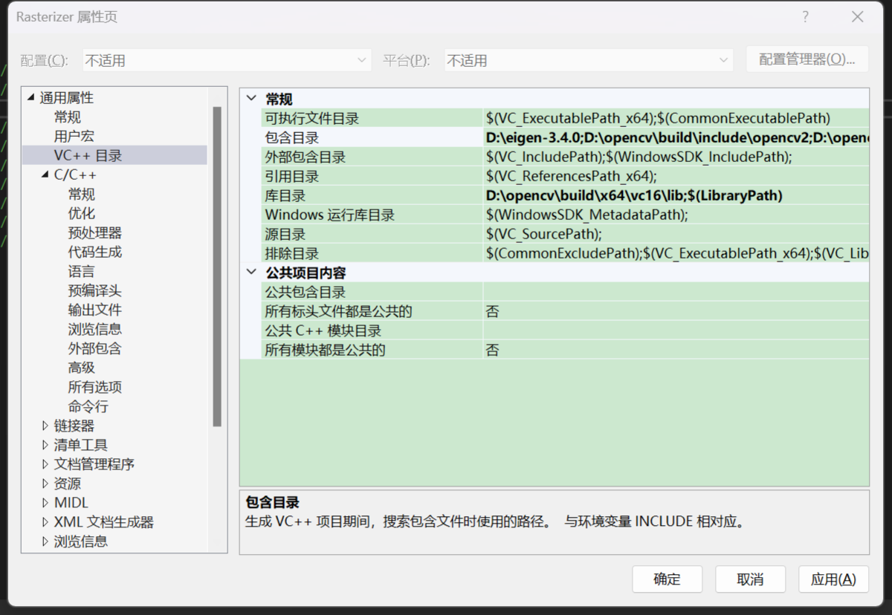
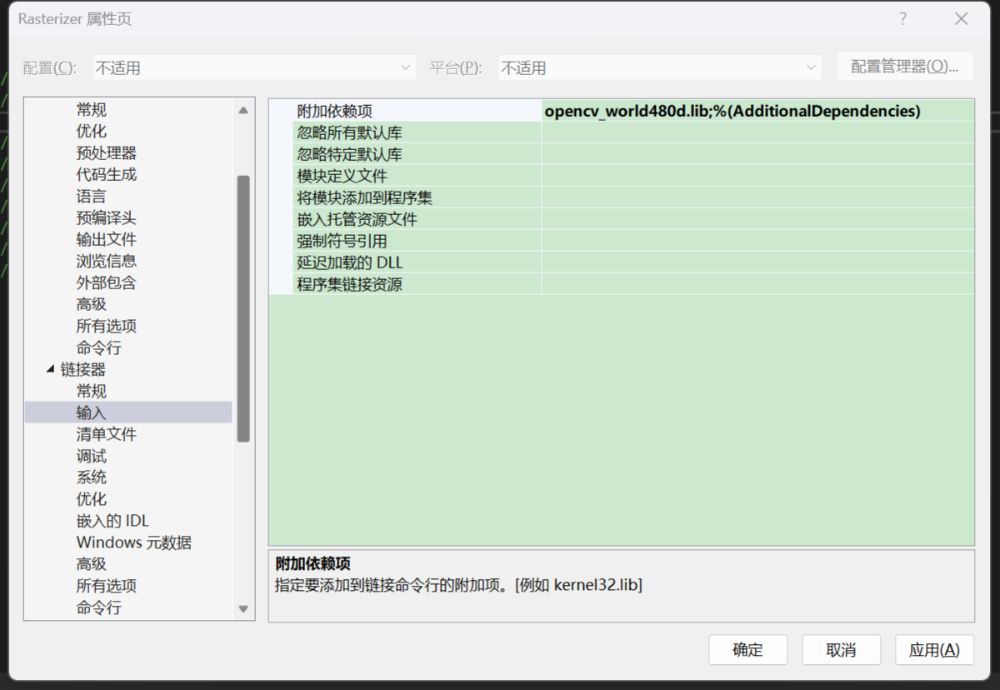

# Games101_Practice

## 环境配置
为VS添加 OpenCV 和 Eigen 库：<br/>
<div align="center">
 </div>

## Assignment 1 Rasterizer 光栅化器
- 核心：MVP变换
- 描述：实现以下几个函数，模拟三角形绕过原点的任意轴进行旋转并经光栅化绘制在屏幕上的过程。
  * model_transformation(Vector3f axis, float rotation_angle)  // 输入旋转轴与角度，得到对应的模型变换矩阵
  * view_transformation(Vector3f eye_pos)  // 输入摄像机位置，得到对应的观测变换矩阵
  * project_transformation(float eye_fov, float aspect_ratio, float zNear, float zFar) // 输入field of view，视野长宽比，近远平面距离，得到对应的透视投影变换矩阵
  * draw(std::map<int, std::vector<Eigen::Vector3f>> pos_buf, std::map<int, std::vector<Eigen::Vector3i>> indice_buf) // 输入三角形顶点坐标，应用MVP变换，然后进行viewport transformation，将三角形转换到指定大小的屏幕上

- 代码细节：
```c++
//用一个vector<Eigen::Vector3f>存储颜色信息，纵坐标设为 height-point.y() 是遵守opencv左上角为原点的规范，用cv库从frame_buf生成图像
void rst::rasterizer::set_pixel(const Eigen::Vector3f& point, const Eigen::Vector3f& color)
{
    //old index: auto ind = point.y() + point.x() * width;
    if (point.x() < 0 || point.x() >= width ||
        point.y() < 0 || point.y() >= height) return;
    auto ind = (height-point.y())*width + point.x();
    frame_buf[ind] = color;
}
```
- 实现效果：
Uploading image 2023-08-11 20-24-36.mp4…
https://github.com/DukeofCambridge/Games101_Practice/assets/68137344/c5a7b255-aafa-452f-962d-49e4d39f27dd

- 参考资料：
  * Bresenham's line algorithm: https://blog.csdn.net/qq_41883085/article/details/102706471
  * Rodrigues' rotation formula: https://blog.csdn.net/qq_36162042/article/details/115488168
