# Games101_Practice

## 环境配置
- 为VS添加 `OpenCV` 和 `Eigen` 库：<br/>
<div align="center">
 </div>

- 项目属性改为ISO C++17 语言标准
- 预处理器定义添加 `_CRT_SECURE_NO_WARNINGS` 以正常使用 `fopen` 等方法

## Assignment 1 Rotation&Projection 旋转与投影
- 核心：MVP变换
- 描述：实现以下几个函数，模拟三角形绕过原点的任意轴进行旋转并经光栅化绘制在屏幕上的过程。
  * `model_transformation(Vector3f axis, float rotation_angle)`  // 输入旋转轴与角度，得到对应的模型变换矩阵
  * `view_transformation(Vector3f eye_pos)`  // 输入摄像机位置，得到对应的观测变换矩阵
  * `project_transformation(float eye_fov, float aspect_ratio, float zNear, float zFar)` // 输入field of view，视野长宽比，近远平面距离，得到对应的透视投影变换矩阵
  * `draw(std::map<int, std::vector<Eigen::Vector3f>> pos_buf, std::map<int, std::vector<Eigen::Vector3i>> indice_buf)` // 输入三角形顶点坐标，应用MVP变换，然后进行viewport transformation，将三角形转换到指定大小的屏幕上

- 代码细节：
```c++
//用一个vector<Eigen::Vector3f>存储颜色信息，纵坐标设为 height-point.y() 是遵守opencv左上角为原点的规范，用cv库从frame_buf生成图像
void rst::rasterizer::set_pixel(const Eigen::Vector3f& point, const Eigen::Vector3f& color)
{
    //old index: auto ind = point.y() + point.x() * width;
    if (point.x() < 0 || point.x() >= width ||
        point.y() < 0 || point.y() >= height) return;
    auto ind = (height-point.y())*width + point.x();
    frame_buf[ind] = color;
}
```
- 实现效果：


https://github.com/DukeofCambridge/Games101_Practice/assets/68137344/090e2952-7c5d-4c45-bd05-d8d9d2ce304e


https://github.com/DukeofCambridge/Games101_Practice/assets/68137344/8814a175-2453-4c8d-b3ee-7ce5bdac3b8b


- 参考资料：
  * Bresenham's line algorithm: https://blog.csdn.net/qq_41883085/article/details/102706471
  * Rodrigues' rotation formula: https://blog.csdn.net/qq_36162042/article/details/115488168

## Assignment 2 Z-buffering 深度缓存
- 核心：fragment-level z-test
- 描述：实现以下几个方法，对三角形内部进行插值填充（颜色与深度）
  * 对视口变换后的三角形生成包围盒(bounding box)
  * 判断某点是否在三角形内部
  * 计算三角形内部点的重心坐标，用于插值
  * 完成z-test的逻辑
  * 利用超采样的方法抗锯齿(MSAA)，将每个像素分成四份，分别计算是否位于三角形内，像素的颜色设定为四个子像素的平均值

- 实现效果：
<div align="center">
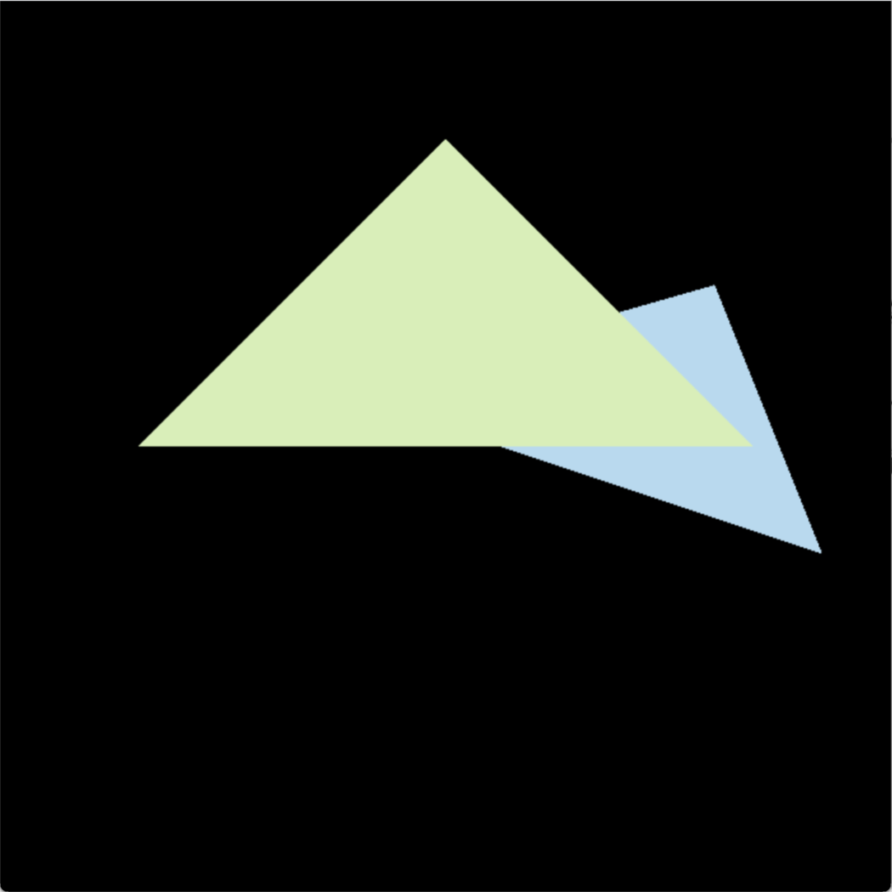</div><br/>

<div align="center">
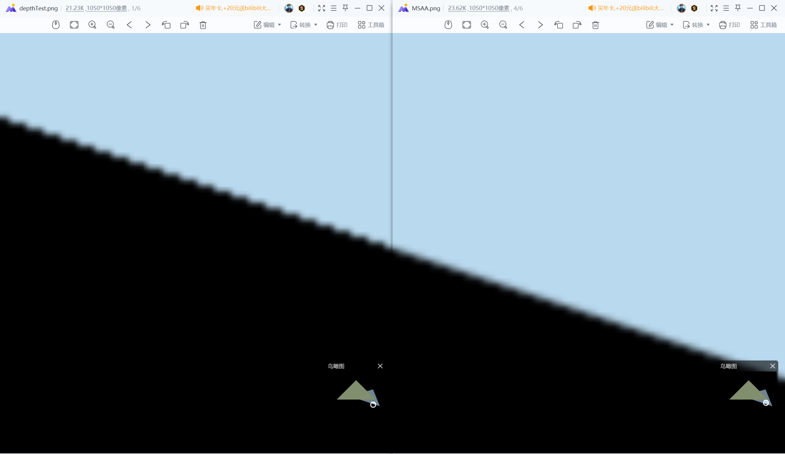<br/>采用MSAA抗锯齿后的效果对比（右图为超采样处理后，本质就是模糊了边界）</div>

## Assignment 3 Shading 着色
- 核心：fragment shader
- 描述：实现以下几个方法，熟悉几种常见的片元着色的逻辑
  * 在assignment2的基础上完善着色逻辑，将深度、法线、纹理坐标、view-space坐标等插值信息传递给fragment shader计算每个像素的颜色值
  * 实现基于blinn-phong 光照模型的 phong shader
  * 实现纹理采样的 texture shader
  * 实现基于凹凸贴图技术的 bump shader
  * 实现基于位移贴图技术的 displacement shader
  * 实现对texture mapping进行双线性插值

- 实现效果：
<div align="center">
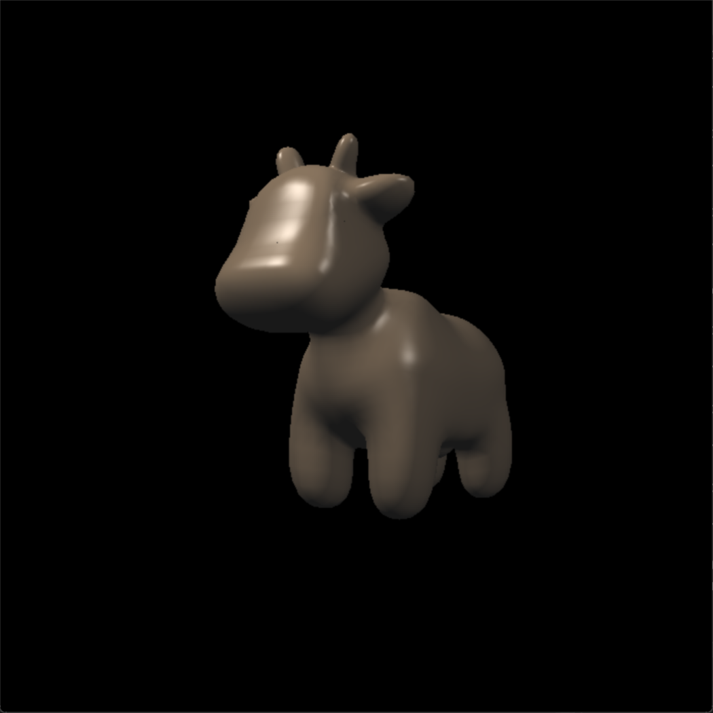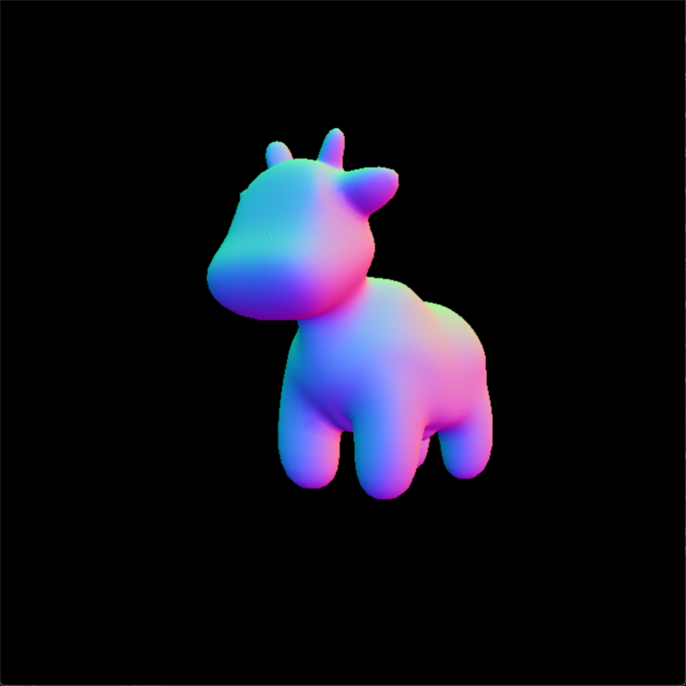<br/>&nbsp&nbsp&nbsp&nbsp&nbsp&nbsp&nbsp phong shader &nbsp &nbsp&nbsp&nbsp&nbsp&nbsp&nbsp&nbsp&nbsp&nbsp&nbsp&nbsp&nbsp&nbsp&nbsp&nbsp&nbsp&nbsp&nbsp&nbsp&nbsp&nbsp&nbsp&nbsp&nbsp&nbsp&nbsp&nbsp&nbsp&nbsp&nbsp&nbsp&nbsp&nbsp&nbsp&nbsp&nbsp&nbsp&nbsp&nbsp&nbsp&nbsp&nbsp&nbsp&nbsp&nbsp&nbsp&nbsp&nbsp&nbsp&nbsp normal shader</div><br/>
<div align="center">
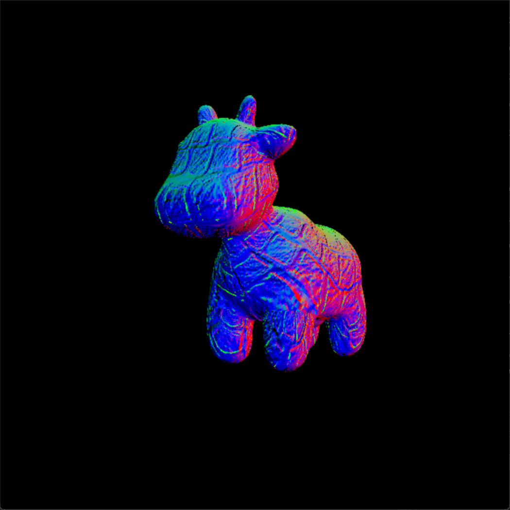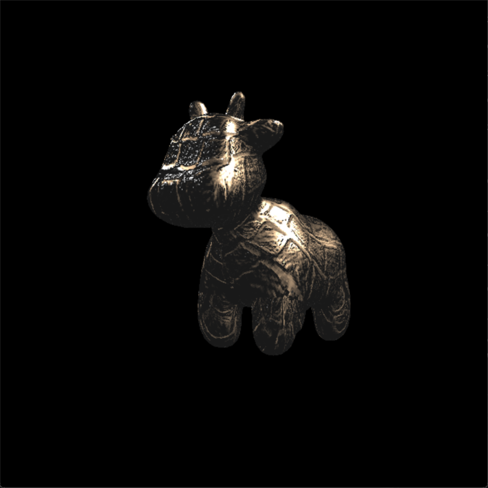<br/>&nbsp&nbsp&nbsp&nbsp&nbsp&nbsp&nbsp&nbsp&nbsp&nbsp bump shader &nbsp &nbsp&nbsp&nbsp&nbsp&nbsp&nbsp&nbsp&nbsp&nbsp&nbsp&nbsp&nbsp&nbsp&nbsp&nbsp&nbsp&nbsp&nbsp&nbsp&nbsp&nbsp&nbsp&nbsp&nbsp&nbsp&nbsp&nbsp&nbsp&nbsp&nbsp&nbsp&nbsp&nbsp&nbsp&nbsp&nbsp&nbsp&nbsp&nbsp&nbsp&nbsp&nbsp&nbsp&nbsp&nbsp&nbsp&nbsp&nbsp displacement shader</div>

<div align="center">
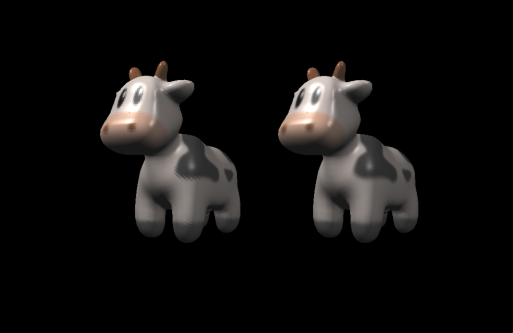<br/>texture双线性插值采样前后效果对比</div>

- 参考资料：
  * Bump Mapping: https://blog.csdn.net/qq_38065509/article/details/106050879
  * DownSamping and UpSampling: https://blog.csdn.net/zhibing_ding/article/details/125254670

## Assignment 4 Bezier Curve 贝塞尔曲线
- 核心：bezier-curve generation
- 描述：实现以下几个方法，通过点击屏幕生成一条贝塞尔曲线
  * 借助 Bernstein polynomials 生成贝塞尔曲线
  * 通过 De Casteljau's algorithm 生成贝塞尔曲线
  * 通过计算哈夫曼距离实现贝塞尔曲线反走样

- 实现效果：
<div align="center">
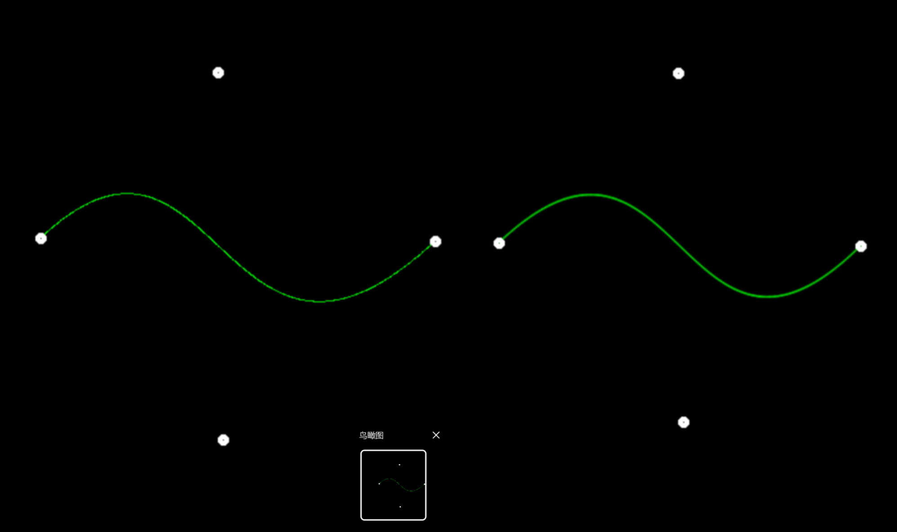<br/>反走样效果对比</div>

## Assignment 5 RayTracing 光线追踪
- 核心：ray-object intersection judgement 
- 描述：实现以下几个方法，通过 whitted-style ray tracing 的思路渲染场景
  * 实现屏幕空间到观测空间的变换，从每个像素处发射光线
  * 实现判断光线与球体、三角形相交的逻辑
  * 对不同类型物体（表面）分别计算 hitcolor
  * 利用fresnel equation计算反射/折射光比重

- 实现效果：
<div align="center">
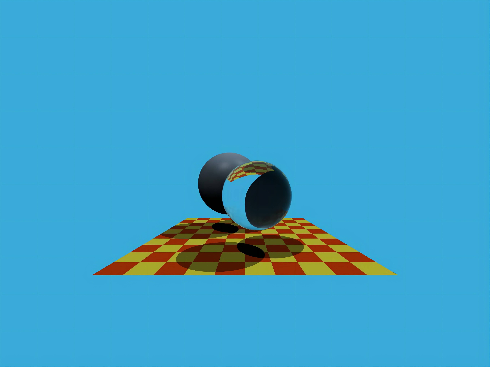<br/></div>

- 参考资料：
  * Möller Trumbore Algorithm: https://zhuanlan.zhihu.com/p/451582864

## Assignment 6 BVH 包围盒加速结构
- 核心：bounding volume hierarchy
- 描述：实现以下几个方法，通过 BVH 方法加速光追处理
  * 实现光线与包围盒求交算法
  * 利用包围盒加速光线与场景求交
  * 优化包围盒加速结构生成算法（实现SAH算法）

- 实现效果：
<div align="center">
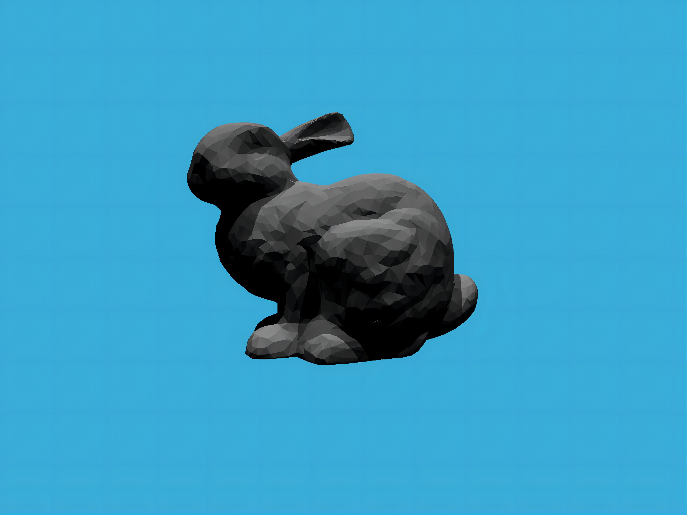<br/></div>
<br/>
<div align="center">
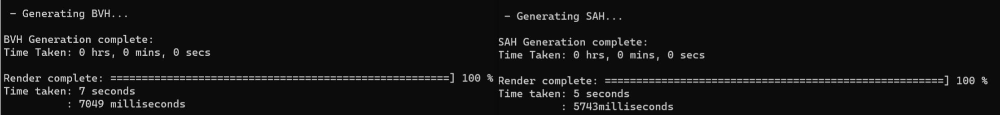<br/>包围盒构建算法对比</div>

- 参考资料：
   * PBRT-BVH&SAH: https://zhuanlan.zhihu.com/p/50720158; https://zhuanlan.zhihu.com/p/475966001

## Assignment 7 PathTracing 路径追踪
- 核心：path tracing
- 描述：
  * 实现基于path tracing算法的光线追踪
  * 多线程执行渲染
  * 实现Microfacet Material

- 实现效果：

- 核心伪代码：
```c++
// 输入camera与pixel的位置（遍历所有pixels）
float generationRay(vec3 camera, vec3 pixel)
{
    float pixel_radiance = 0.0; //初始化像素受到的辐射率
    for(int i=0; i < count; i++) //从相机处向每个像素的方向发射若干根光线，结果取均值
    {
        vec3 pos = random() by pdf; //根据pdf随机得到像素内的一个位置
        ray r = ray(camera, pos-camera); //发射射线
        if(r hit object at p) //如果射线打到物体上，交点为P
        {
            //利用shade()函数计算P点往camera方向的radiance，所有光线结果取均值
            pixel_radiance += (1/count) * shade(p, camera-pos);
        }
    }
    return pixel_radiance;
}
```
```c++
// 输入点P坐标和从P点到camera的方向向量，计算光线颜色，用来设置这根光线通过的像素的颜色
float shade(vec3 p, vec3 wo)
{
    //直接光部分
    vec3 q = random() by pdf_light; //光源上随机采样一个Q点，保证不浪费这根光线的计算
    vec3 wi = normalize (q - p); //从点P到点Q的方向向量
    float l_dir = vec3(0.0); //直接光颜色初始化
    ray r2light = ray(p, wi); //发射光线
    if(r2light hit light at q) //如没有障碍物则计算颜色
        l_dir = fr(p, wi, wo) * li(p, wi) * dot(n, wi) * dot(n`, wi) / pdf_light(q) / len(q-p)^2; 
        // 这里采用蒙特卡洛方法代替求积分计算渲染方程（反射方程），但采样数N=1，所以概率密度函数就是1/A（A是面光源面积），通过每一像素发射大量光线求均值的方法来减小误差
        // 该式为反射方程的变体，d(wi)=d(A)*dot(n`, wi)/len(q-p)^2; 即立体角等于球面上对应的一个面积除以半径平方，转变为对A积分（用蒙特卡洛方法求解）
        // fr(p, wi, wo): BRDF
        // li(p,wi): P点在wi方向接收的辐射率 radiance
        // li(p,wi)*dot(n,wi): P点发出的辐照度 irradiance
        // pdf_light(q): 光源采样的概率密度函数（1/A）
        // len(q-p)^2: PQ距离的平方
    
    //间接光部分
    float l_indir = vec3(0.0); //间接光颜色初始化
    float prob = 0.6; //轮盘赌方法保证函数不会无限递归，同时又保证l_indir期望值不变
    float num = random(0,1);
    if(num < prob)
    {
        vec3 wi = random() by pdf; //间接光部分仍是在半球上的各个方向进行立体角的随机采样，对wi积分，因此pdf=1/2π
        ray r = ray(p, wi); //发射光线
        // object不能是光源，如果r打在了光源上则忽略
        if(r hit object at o)
            l_indir = fr(p, wi, wo) * shade(o, -wi) * dot(n, wi) / pdf(wi) / prob;
            //仍然是反射方程的变体，递归调用shade(o, -wi)函数代替li(p,wi)，同时所得结果要除以prob以维持l_indir期望值不变
    }
    return emission + l_dir + l_indir; //P点的 自发光+直接光辐射+间接光辐射 作为光线颜色的最终值
}
```
- 参考资料：
  * PathTracing: https://zhuanlan.zhihu.com/p/370162390
  * PBR: https://learnopengl.com/PBR/Theory
  * Microfacet BRDF: https://sites.cs.ucsb.edu/~lingqi/teaching/resources/GAMES101_Lecture_17.pdf